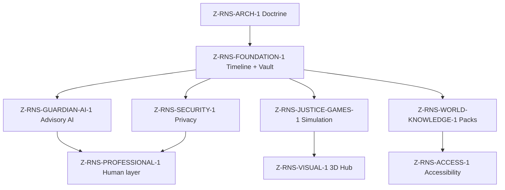

# Z-Reality Navigation System — Master Architecture

**Phase:** Z-RNS-ARCH-1 (architecture doctrine — no runtime)
**Parent:** [Z_REALITY_NAVIGATION_SYSTEM.md](Z_REALITY_NAVIGATION_SYSTEM.md)

---

## System definition

```text
Reality Navigation System (RNS)
  ├── Layer 1 — Z-Justice Games        (learn without fear — synthetic)
  ├── Layer 2 — Z-Legal Evidence Core  (organise real evidence — local-first)
  └── Layer 3 — Z-Life Navigation      (wider human support — accessibility)
```

**Secret weapon:** human clarity amplification — not AI law replacement.

---

## Target stack (phased — not all at once)

| Tier     | Technology                                | When                        |
| -------- | ----------------------------------------- | --------------------------- |
| UI shell | HTML5, CSS (Tailwind optional), JS/TS     | Phase 1 prototype           |
| Build    | Vite                                      | Phase 1 prototype           |
| Storage  | Local-first, IndexedDB                    | Phase 1 after UI charter    |
| Desktop  | Electron / Tauri                          | Post-prototype — human gate |
| 3D       | Three.js / Canvas / WebGPU (future)       | Phase 5 visualisation only  |
| AI       | Advisory summaries, offline-first charter | Phase 4 — no fake claims    |

No cloud dependency is required for daily hub posture.

---

## Phase map (master roadmap)

### Phase 1 — Foundation Core (“The Skeleton”)

**ID:** Z-RNS-FOUNDATION-1 (delivered) · **Z-RNS-FOUNDATION-1A** (Canvas map — delivered)

| Module                     | Purpose                          | Runtime (Phase 1)                       |
| -------------------------- | -------------------------------- | --------------------------------------- |
| Timeline Builder           | Event chronology                 | IndexedDB local CRUD                    |
| Evidence Vault             | Photos / videos / docs metadata  | IndexedDB blobs — device local          |
| Cause → Effect Canvas map  | Root-cause chain visualisation   | **1A** — read-only 2D Canvas            |
| Receipt & Invoice Analyzer | Damage / invoice checklist logic | Metadata + real                         |
| Health Timeline            | Medical event tracking (private) | Sketch                                  |
| GDPR / CCTV Tracker        | Request lifecycle awareness      | Process map only                        |
| Court Export Pack          | PDF bundle concept               | Manual export charter                   |
| Voice Notes                | Stress memory capture            | Blocked until consent charter           |

**Out of scope for Foundation:** live AI, courtroom simulation, 3D hub, professional marketplace.

---

### Phase 2 — Justice Simulation Engine (“Learn Without Fear”)

**ID:** Z-RNS-JUSTICE-GAMES-1 (planned)

See [Z_JUSTICE_GAMES.md](Z_JUSTICE_GAMES.md).

| Simulation role        | Purpose               | Label                                |
| ---------------------- | --------------------- | ------------------------------------ |
| Judge persona          | Process understanding | **Synthetic mentor — not a judge**   |
| Police / Garda persona | Procedure simulation  | **Synthetic — not authority**        |
| Lawyer persona         | Evidence review drill | **Not legal advice**                 |
| Reflection persona     | Emotional regulation  | Wellness support — not therapy claim |
| Clerk persona          | Documentation flow    | Training only                        |

Features (all synthetic): courtroom flow, evidence challenges, invoice verification drills, witness sequence, timeline contradictions, stress-mode scenarios.

**Safeguard:** explicit simulation banner; no real client data; aligns with [Z_LEGAL_WORKSTATION_SIMULATION_MODE.md](Z_LEGAL_WORKSTATION_SIMULATION_MODE.md).

---

### Phase 3 — World Knowledge Engine (“Global Awareness Layer”)

**ID:** Z-RNS-WORLD-KNOWLEDGE-1 (sketch)

Country packs (Ireland, Mauritius, France, UK, EU, USA, …) deliver:

- Process maps
- Typical timelines (illustrative)
- Terminology glossaries
- Common mistakes (educational)
- Evidence expectations (general — **not** case-specific advice)

**Not included:** jurisdiction-specific legal advice, filing automation, or “you should sue” guidance.

---

### Phase 4 — AI Intelligence Layer (“Z-Guardian AI — advisory only”)

**ID:** Z-RNS-GUARDIAN-AI-1 (blocked until charter)

| Capability     | Role                                   | Boundary                          |
| -------------- | -------------------------------------- | --------------------------------- |
| Timeline AI    | Reconstruct chronology from user notes | Human verifies every output       |
| Evidence AI    | Flag missing proof categories          | Checklist — not legal strategy    |
| Summary AI     | Simplify documents user already holds  | No privileged inference           |
| Voice AI       | Accessible guidance                    | No impersonation of professionals |
| Translation AI | Multilingual UI / glossaries           | Human review for legal terms      |
| Calm AI        | Stress reduction prompts               | Not medical or therapy claim      |

AI **does not replace** lawyers, doctors, therapists, or courts.

---

### Phase 5 — 3D World & Canvas (“Reality Visualisation Engine”)

**ID:** Z-RNS-VISUAL-1 (future sketch)

| Environment        | Purpose                                                     |
| ------------------ | ----------------------------------------------------------- |
| Justice City       | Courts, stations, offices — **navigational metaphor**       |
| Nature Logic World | Cause → effect, ethical balance visualisation               |
| Memory Chamber     | Timeline corridors, evidence clusters — **local data only** |
| Global Pulse Map   | Awareness / education access — no live legal telemetry      |

Technology options: Three.js, React Three Fiber, Babylon.js, Canvas API, WebGPU (future). Governed by [Z_OMNI_VISUAL_WORKSTATION_ENGINE_CHARTER.md](Z_OMNI_VISUAL_WORKSTATION_ENGINE_CHARTER.md).

---

### Phase 6 — Security & Privacy

**ID:** Z-RNS-SECURITY-1 (policy parallel to build)

- Encrypted local vaults
- Local-first mode default
- Consent-based sharing
- Redaction tools
- Export control + audit logs

Aligns with Z-SMA dignity-first posture where human-life stories intersect RNS.

---

### Phase 7 — Professional Ecosystem

**ID:** Z-RNS-PROFESSIONAL-1 (human gate — no marketplace automation)

| Human      | Role                      |
| ---------- | ------------------------- |
| Lawyers    | Professional legal advice |
| Doctors    | Medical review            |
| Therapists | Stress support            |
| NGOs       | Social assistance         |
| Advocates  | Awareness / support       |

Platform **routes to** humans; it does **not** impersonate or endorse without written consent.

---

### Phase 8 — World Service Mode (Accessibility)

**ID:** Z-RNS-ACCESS-1

- Blind / screen-reader mode
- Voice mode
- Dyslexia / simplified mode
- Low-literacy guidance
- Multilingual support

---

## Module dependency graph



---

## Cursor immediate build order

1. **Z-RNS-ARCH-1** — README, doctrine, architecture, registry (**current**)
2. **Z-RNS-FOUNDATION-1** — Timeline + Evidence Vault local UI prototype (IndexedDB) — **delivered**
3. **Z-RNS-FOUNDATION-1A** — Cause → Effect Canvas map (read-only 2D) — **delivered**
4. **Z-RNS-GUARDIAN-AI-1** — summary engine sketch with offline-first boundary doc
5. **Z-RNS-JUSTICE-GAMES-1** — simulation courtroom (synthetic data only)
6. **Z-RNS-VISUAL-1** — 3D Justice Hub (Root Cause Forest — Three.js charter)

---

## Acceptance criteria per step

| Step | Must have                                    | Must not have            |
| ---- | -------------------------------------------- | ------------------------ |
| 1    | Registry JSON, policy, receipts, INDEX links | Runtime, uploads, AI API |
| 2    | Local timeline + vault UI, export preview    | Cloud sync, court filing |
| 3    | Advisory summary with human-confirm UX       | “Legal advice” labeling  |
| 4    | Simulation banner + synthetic fixtures       | Real client intake       |
| 5    | Visual metaphor only                         | Live data feeds          |

---

## Rollback

Revert docs under `docs/Z_REALITY_NAVIGATION_*`, `docs/Z_JUSTICE_GAMES.md`, `docs/Z_LIFE_NAVIGATION_ECOSYSTEM.md`, registry JSON, check script, and INDEX rows from Git history.

---

_Architecture is a map — not permission to deploy._
