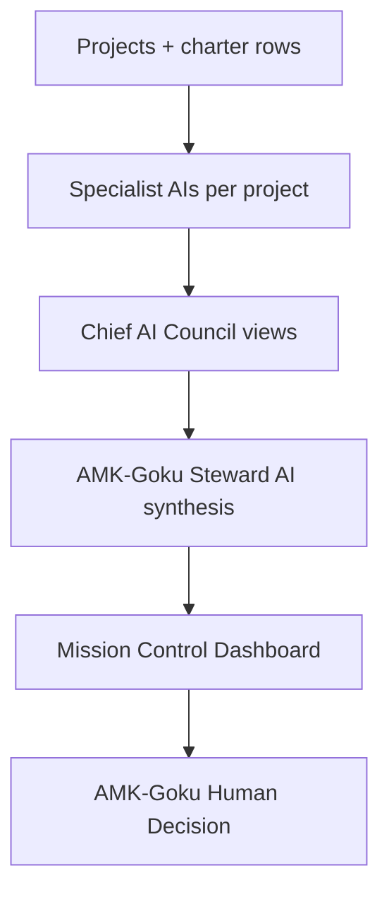

# AMK-Goku Steward AI — Decision Pipeline

**System ID:** AMK-GOKU-STEWARD-AI-PIPELINE-1  
**Date:** 2026-07-08  
**Posture:** Human-in-the-loop · read-only inputs · no auto-execution

---

## Pipeline law

```text
Observe → Synthesize → Recommend → Human decides → (optional) Execute via gated workflows
```

Steward operates only in **Observe · Synthesize · Recommend**.

Execution is **never** Steward-autonomous.

---

## End-to-end flow



---

## Stage definitions

| Stage | Actor | Output |
| ----- | ----- | ------ |
| 1. Project signal | MC / census / readiness | Purpose, stage, blockers |
| 2. Specialist routing | Per-project `ai_ecosystem` | Which chief owns the question |
| 3. Council rollup | Chief AIs (documented roles) | Domain-specific advisory |
| 4. Steward synthesis | Steward interface (future UI / today: docs) | One executive summary |
| 5. Dashboard display | AMK Indicator Dashboard | Read-only panels |
| 6. Human decision | AMK-Goku | Merge, build, defer, wake, archive |

---

## Gate checklist (every recommendation)

Before Steward surfaces a “next step,” documentation requires checking:

| Gate | Source |
| ---- | ------ |
| Merge Hold | `data/z_release_control.json` |
| Turtle Mode | `.cursor/rules/z-turtle-mode-cursor-agents.mdc` |
| 14 DRP | [Z_SWARM_14DRP_UNIVERSAL_AGENT_LAW.md](../Z_SWARM_14DRP_UNIVERSAL_AGENT_LAW.md) |
| Track priority | Track A P0 until foundation green |
| Architecture freeze | Z-Connect frozen · Soulmates B2 docs only |
| Sacred moves | Payments, deploy, merge — human only |

If any gate blocks: recommendation must say **WAIT** and **why** — not “do it anyway.”

---

## Recommendation classes

| Class | Meaning | Example |
| ----- | ------- | ------- |
| **P0 Human** | Steward cannot proceed; AMK required | Release Merge Hold for VILE |
| **P1 Review** | Evidence ready; human review | Read foundation readiness ledger |
| **P2 Deferred** | Correctly sleeping | Pets Care — Turtle Mode |
| **P3 Opportunity** | Non-urgent strategic | MC-0.8 after Track A |
| **BLOCKED** | Governance intentional wait | Public runtime |

Recommendations are **derived from registry** — see [MC-0.7 charter](../dashboard/Z_UNIVERSE_MC_0_7_INTELLIGENCE_LAYER_CHARTER.md).

---

## Sleep / wake decisions

Aligns with foundation doctrine:

> Every project should be able to sleep without being forgotten, and wake without losing its purpose.

| Posture | Steward behavior |
| ------- | ---------------- |
| **Sleeping** | Show purpose, AI team, next milestone — no nagging |
| **Ready to wake** | Surface wake-up cost (future MC-0.7) + human action |
| **Active** | Show Track alignment + blockers |
| **Archived** | Memory only — no auto-delete |

Census fields: `census.turtle_indicator` · `timeline.next_recommended_action`

---

## Conflict resolution

When chiefs disagree (e.g. engineering ready vs governance hold):

1. Steward presents **both** views with evidence links  
2. Default posture: **governance wins** until human releases gate  
3. AMK decides — Steward records outcome in [UNIVERSE_CHANGELOG.md](../UNIVERSE_CHANGELOG.md) when sealed  

---

## What Steward must never do

- Auto-merge PRs  
- Auto-run verify pipelines  
- Auto-deploy Cloudflare  
- Auto-wake dormant projects  
- Override “Merge Hold ACTIVE” with “green” language  

---

## Related

- [AMK_GOKU_STEWARD_AI_CHARTER.md](AMK_GOKU_STEWARD_AI_CHARTER.md)
- [AMK_GOKU_STEWARD_AI_DASHBOARD_SPEC.md](AMK_GOKU_STEWARD_AI_DASHBOARD_SPEC.md)
- [AMK_AUTONOMOUS_APPROVAL_LADDER.md](../AMK_AUTONOMOUS_APPROVAL_LADDER.md) (AAL-1 sacred vs auto lanes)
