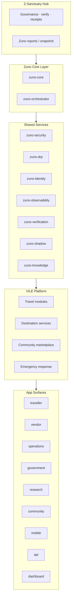

# VILE Architecture Overview

**Version:** 1.0 · design only

## Layer diagram

## Dependency rules

| Rule | Detail |
| ---- | ------ |
| **Down only** | Apps call platform APIs; platform calls shared services; shared services call Zuno contracts |
| **No sideways agents** | Agents never call agents — orchestrator only |
| **Hub read-only by default** | Dashboard surfaces consume reports; no silent cross-repo mutation |
| **Offline boundary** | Traveller-critical data replicated to device vault — see [OFFLINE_FIRST_DESIGN.md](OFFLINE_FIRST_DESIGN.md) |

## Current reality (hub clone)

| Layer | On disk today |
| ----- | ------------- |
| Hub governance | `Z_Sanctuary_Universe` — verify PASS |
| Zuno contracts | `packages/zuno-orchestrator-contracts` — **contracts only** |
| Zuno core slice | `packages/z-sanctuary-core` — metadata loaders |
| VILE apps | **Not chartered** — `apps/web`, `apps/api` exist as hub seeds, not VILE product |
| Agent runtime | **Not running** — spec only |

## Data flows (target)

1. **Traveller request** → API gateway → DRP middleware → orchestrator plan → agent execution → shadow pipeline → response  
2. **Vendor onboarding** → identity + compliance agents → human approval gate → marketplace index  
3. **Emergency** → offline-capable local bundle + optional sync when online — never fabricate medical advice  

## Non-goals (Phase 1)

- Multi-region active-active deploy  
- Live payment settlement  
- Autonomous background improvement loops  
