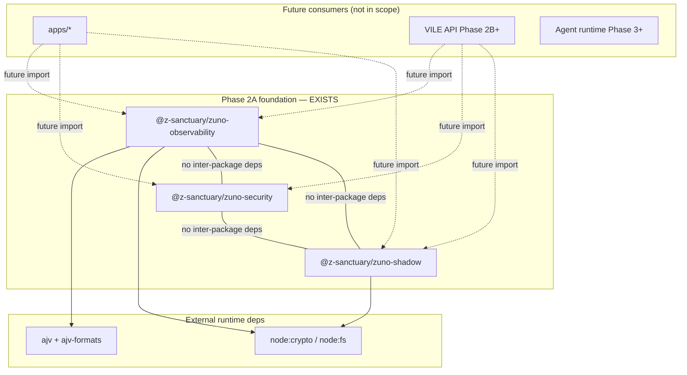

# Phase 2A Foundation Integration Report

**System:** Z-Sanctuary Universe · VILE Platform  
**Scope:** Packages 1–3 (`@z-sanctuary/zuno-observability`, `@z-sanctuary/zuno-security`, `@z-sanctuary/zuno-shadow`)  
**Date:** 2026-06-11  
**Posture:** Read-only verification · **Merge Hold** on all package PRs until human gate  
**Purpose:** Stable architectural baseline before chartering `@z-sanctuary/zuno-drp` (Package 4)

## Executive summary

| Check | Result |
| ----- | ------ |
| All three packages build together | **GREEN** |
| All unit tests pass | **GREEN** (30/30) |
| Inter-package circular dependencies | **NONE** |
| Dependency direction (apps → packages) | **CORRECT** — packages do not import apps or each other |
| Barrel exports (`src/index.ts` → `dist/index.d.ts`) | **GREEN** |
| README / package metadata consistency | **GREEN** (minor notes below) |
| Zero runtime coupling between foundation packages | **GREEN** |
| No application-specific code in packages | **GREEN** |
| Documentation links in READMEs | **GREEN** |

**Recommendation:** Foundation is coherent for human review and merge of Packages 1–3. Package 4 (`zuno-drp`) may be chartered **after** those merges land on `main`.

## Packages under review

| # | Package | Path | Runtime npm deps |
| - | ------- | ---- | ---------------- |
| 1 | `@z-sanctuary/zuno-observability` | `packages/zuno-observability` | `ajv`, `ajv-formats` |
| 2 | `@z-sanctuary/zuno-security` | `packages/zuno-security` | *(none)* |
| 3 | `@z-sanctuary/zuno-shadow` | `packages/zuno-shadow` | *(none)* |

All three: `typescript` dev-only · `private: true` · `version: 0.1.0` · `engines.node >= 18`

## Build verification

Commands run from hub root (`Z_Sanctuary_Universe`):

```bash
npm run build --workspace=@z-sanctuary/zuno-observability
npm run build --workspace=@z-sanctuary/zuno-security
npm run build --workspace=@z-sanctuary/zuno-shadow
```

| Package | `tsc` | Exit |
| ------- | ----- | ---- |
| zuno-observability | strict compile + declarations | 0 |
| zuno-security | strict compile + declarations | 0 |
| zuno-shadow | strict compile + declarations | 0 |

## Test verification

```bash
npm run test --workspace=@z-sanctuary/zuno-observability   # 8/8
npm run test --workspace=@z-sanctuary/zuno-security         # 12/12
npm run test --workspace=@z-sanctuary/zuno-shadow          # 10/10
```

| Package | Tests | Skipped | Failures |
| ------- | ----- | ------- | -------- |
| zuno-observability | 8 | 0 | 0 |
| zuno-security | 12 | 0 | 0 |
| zuno-shadow | 10 | 0 | 0 |
| **Total** | **30** | **0** | **0** |

## Dependency graph

Foundation packages are **sibling leaves** — no edges between them. Future consumers (apps, API, agents) sit above this layer.



### Intended dependency direction

```text
docs/vile/platform-contracts  →  (inform)  →  Phase 2A packages
Phase 2A packages             →  (imported by)  →  apps / API / agents (future)
Phase 2A packages             ✗  must not import  →  apps, dashboard, core hub scripts
```

**Verified:** No `@z-sanctuary/zuno-*` import of another foundation package. No `apps/` paths in any `packages/zuno-*/src` tree.

## Circular dependency analysis

| From | To | Finding |
| ---- | -- | ------- |
| zuno-observability | zuno-security, zuno-shadow | None |
| zuno-security | zuno-observability, zuno-shadow | None |
| zuno-shadow | zuno-observability, zuno-security | None |
| Any foundation package | apps/* | None |

Internal module graphs within each package are acyclic (types → validators/builders → index barrel).

## Barrel export verification

Each package exposes a **single public entry** via `package.json` `exports["."]` → `dist/index.js` / `dist/index.d.ts`.

| Package | Barrel file | Declarations generated | Deep import required |
| ------- | ----------- | ---------------------- | -------------------- |
| zuno-observability | `src/index.ts` | Yes | No |
| zuno-security | `src/index.ts` | Yes | No |
| zuno-shadow | `src/index.ts` | Yes | No |

### Public surface summary

**zuno-observability** — constants, event types, AJV validator, timestamp guards, `ObservabilityEventBuilder`

**zuno-security** — classification constants, trust/guard types, validation helpers, `ZeroTrustPolicy` descriptor

**zuno-shadow** — stage constants, pipeline/rule types, four builders, `executeShadowPipeline`, config validator

Consumers should import only from package root (`@z-sanctuary/zuno-*`), not from internal `src/` paths.

## README and package metadata consistency

| Field | observability | security | shadow |
| ----- | ------------- | -------- | ------ |
| Scope naming | Phase 2A Pkg 1 | Phase 2A Pkg 2 | Phase 2A Pkg 3 |
| `private` | true | true | true |
| `license` | MIT | MIT | MIT |
| `main` / `types` | dist | dist | dist |
| `files` | dist + schemas + docs | dist + docs | dist + docs |
| README sections | Purpose, boundaries, tests, rollback | Same pattern | Same pattern |
| GREEN_RECEIPT | Yes | Yes | Yes |
| ROLLBACK | Yes | Yes | Yes |
| CHANGELOG | Yes | Yes | Yes |

### Minor notes (non-blocking)

- `zuno-observability` description omits "Package 1" label; README header includes it — acceptable.
- `ValidationResult` type name exists in both observability and security packages with **different shapes** — no cross-import today; consumers must namespace by package when both are used (document for Pkg 4+ integration).

## Zero runtime coupling

| Coupling type | observability | security | shadow |
| ------------- | ------------- | -------- | ------ |
| Network (fetch, HTTP clients) | None | None | None |
| LLM / AI providers | None | None | None |
| Database drivers | None | None | None |
| Hub `apps/` or `dashboard/` imports | None | None | None |
| Cross foundation-package imports | None | None | None |
| Background daemons | None | None | None |

**Local-only I/O:** `zuno-observability` reads bundled JSON schema via `node:fs` at validation time — not network coupling.

**Apps check:** `apps/*` contains **no** imports of `@z-sanctuary/zuno-observability`, `zuno-security`, or `zuno-shadow` yet — foundation remains integration-neutral until Phase 2B+ wiring.

## Application-specific code check

Scanned `packages/zuno-{observability,security,shadow}/src` for:

- `apps/`, `dashboard/`, booking, vendor, payment paths — **none**
- `openai`, `anthropic`, `fetch(` — **none**
- TypeScript `any` — **none** in all three `src/` trees

Packages contain contracts, validators, builders, and test helpers only.

## Documentation link verification

README relative links resolved from each package root:

| Package | Linked doc | Exists |
| ------- | ---------- | ------ |
| zuno-observability | `docs/vile/platform-contracts/schemas/v1/observability-event.schema.json` | Yes |
| zuno-security | `docs/vile/SECURITY_ZERO_TRUST.md` | Yes |
| zuno-security | `docs/vile/SYSTEM_BOUNDARIES.md` | Yes |
| zuno-shadow | `docs/vile/SHADOW_VALIDATION_PIPELINE.md` | Yes |
| zuno-shadow | `docs/vile/SYSTEM_BOUNDARIES.md` | Yes |
| zuno-shadow | `docs/vile/VILE_CANONICAL_SYSTEM_BLUEPRINT.md` | Yes |
| zuno-shadow | `docs/vile/platform-contracts/` | Yes |

## Known limitations (foundation layer)

- Packages are **not yet wired** into apps, API, or agent runtime — by design (Phase 2A).
- No shared `zuno-core` facade — consumers import packages individually.
- `zuno-drp` (Pkg 4) not started — compliance stage in shadow is a contract hook only.
- Duplicate type name `ValidationResult` across observability and security — resolve at integration time with explicit imports or aliases.
- Hub branch stack may include non-VILE commits until PRs are split or merged — human review should confirm merge scope.

## Recommended merge sequence

1. Human review + **Merge Hold** release on Package 3 PR (`cursor/zsanctuary/vile-zuno-shadow-2a`).
2. Merge Packages 1–3 to `main` (may be one stacked PR or sequential — AMK chooses).
3. Charter **Package 4** — `@z-sanctuary/zuno-drp` — only after foundation is on `main`.

## Related receipts

- [packages/zuno-observability/GREEN_RECEIPT.md](../../packages/zuno-observability/GREEN_RECEIPT.md)
- [packages/zuno-security/GREEN_RECEIPT.md](../../packages/zuno-security/GREEN_RECEIPT.md)
- [packages/zuno-shadow/GREEN_RECEIPT.md](../../packages/zuno-shadow/GREEN_RECEIPT.md)
- [PHASE_2A_FOUNDATION_INTEGRATION_GREEN_RECEIPT.md](PHASE_2A_FOUNDATION_INTEGRATION_GREEN_RECEIPT.md)
