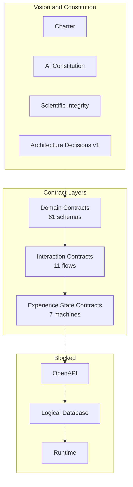

# 02 — Architecture Map

**Handbook chapter** · [INDEX](INDEX.md)

## Layer stack (frozen at Phase 1.5)

```text
Vision & Constitution          ✅  Why
Domain Contracts (B1)          ✅  What exists
Interaction Contracts (B1.5)   ✅  How participants interact
Experience State Contracts     ✅  How experiences evolve
Reference Architecture         ✅  This handbook (consolidation)
─────────────────────────────────────────────────────────
OpenAPI (Phase 1.6)            🔒  HTTP surface
Logical Database (Phase 1.6)   🔒  Persistence model
Reference implementation       🔒  Sprint 0+
Runtime / Deploy               🔒  Sacred gate
```

## Separation of concerns



## Canonical decision pipeline

Every AI and governance-sensitive path follows:

```text
Human Action
  → Consent Verification
    → Security Classification
      → DRP Governance
        → AI Processing (if applicable)
          → Shadow Validation (if AI output)
            → Human Review (if sacred)
              → Experience State transition + Audit
```

Sources: [INTERACTION_CONTRACT_LAW.md](../interaction-contracts/INTERACTION_CONTRACT_LAW.md) · [ESC_LAW.md](../experience-state-contracts/ESC_LAW.md)

## Hub stack placement

Z-Connect **reuses** hub packages — does not fork:

| Package | Role |
| ------- | ---- |
| `zuno-security` | Classification, Zero Trust descriptors |
| `zuno-shadow` | AI output validation |
| `zuno-drp` | Sacred move governance |
| `zuno-observability` | Audit events, correlationId |

[Z_CONNECT_STACK_PLACEMENT.md](../Z_CONNECT_STACK_PLACEMENT.md) · [VILE Phase 2A](../../vile/PHASE_2A_FOUNDATION_INTEGRATION_REPORT.md)

## Contract dependency flow

```text
common/_definitions
  → user, consent
    → connection, discovery, ai
      → messaging, family, subscription
        → moderation, governance
```

[DEPENDENCY_MAP.md](../platform-contracts/DEPENDENCY_MAP.md)

## Document topology

```text
docs/z-connect/
├── Z_CONNECT_*                    (charter, decisions, constitution)
├── platform-contracts/            (B1 — data)
├── interaction-contracts/         (B1.5 — behaviour)
├── experience-state-contracts/    (B1.6 — lifecycle)
└── REFERENCE_ARCHITECTURE/        (this handbook)
```

## Immutable rule (every layer)

> No AI-generated compatibility insight shall be presented as objective truth.

[Z_CONNECT_ARCHITECTURE_DECISIONS_V1.md](../Z_CONNECT_ARCHITECTURE_DECISIONS_V1.md)
