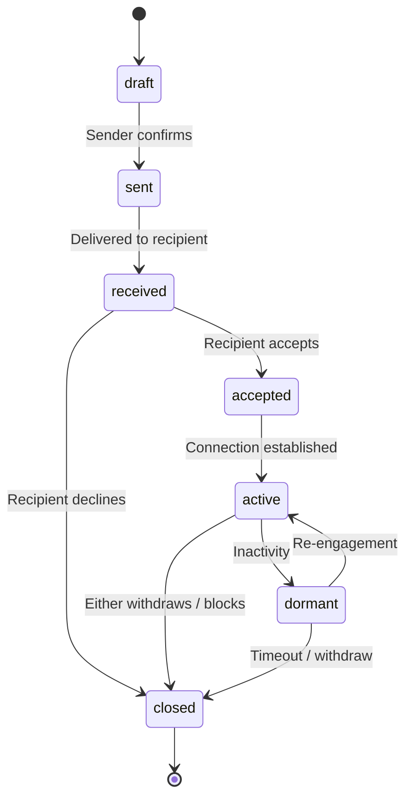

# Connection Request — State Contract

**Project:** Z-Connect  
**Domain schemas:** `connection-request`, `connection-state`  
**Flow:** [Connection Request](../../interaction-contracts/flows/CONNECTION_REQUEST_FLOW.md)

## State diagram

## States

| State | Meaning | Actor | Terminal |
| ----- | ------- | ----- | -------- |
| draft | Composed, not sent | Sender | No |
| sent | Sender confirmed, in transit | Sender | No |
| received | Delivered to recipient | System | No |
| accepted | Recipient agreed | Recipient | No |
| active | Live connection | Both | No |
| dormant | Idle but not closed | System | No |
| closed | Declined, withdrawn, or blocked | Either | Yes |

## Transitions

| From | To | Trigger | Gates |
| ---- | -- | ------- | ----- |
| draft | sent | Sender confirms | Consent (invite) |
| sent | received | Delivery | — |
| received | accepted | Recipient accepts | — |
| received | closed | Recipient declines | — |
| accepted | active | Connection established | — |
| active | dormant | Inactivity window | — |
| dormant | active | Re-engagement | — |
| active | closed | Withdraw / block | — |

## Governance notes

- No **auto-accept** — recipient must act (interaction contract law).
- `accepted → active` may enable a [Conversation](CONVERSATION_STATE.md) `active`.
- Block is a first-class path to `closed`; see [Moderation](MODERATION_APPEAL_STATE.md).

## Out of scope

- Dormancy timeout values · notification cadence (Phase 1.6+)
