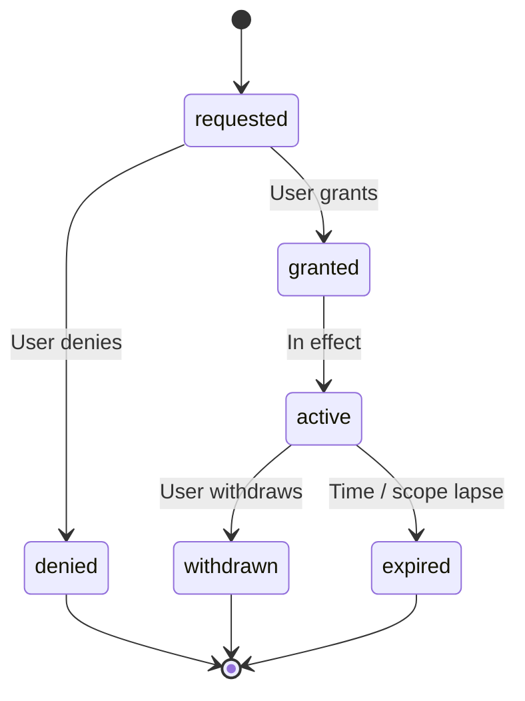

# Consent Record — State Contract

**Project:** Z-Connect  
**Domain schemas:** `consent-record`, `consent-withdrawal`  
**Flow:** [Consent](../../interaction-contracts/flows/CONSENT_FLOW.md)

## State diagram

## States

| State | Meaning | Actor | Terminal |
| ----- | ------- | ----- | -------- |
| requested | Consent asked, awaiting user | System | No |
| granted | User granted (transitional) | User | No |
| active | Consent currently in effect | System | No |
| denied | User declined | User | Yes |
| withdrawn | User revoked | User | Yes |
| expired | Lapsed by time or scope | System | Yes |

## Transitions

| From | To | Trigger | Gates |
| ---- | -- | ------- | ----- |
| requested | granted | User grants | Consent (explicit) |
| requested | denied | User denies | — |
| granted | active | Recorded, in effect | — |
| active | withdrawn | User revokes | — |
| active | expired | Time / scope lapse | — |

## Governance notes

- Consent records are **append-only** in the future logical DB — a withdrawal is a new record/transition, not an edit.
- Withdrawal must **propagate**: dependent experiences (Discovery capture, Dream Baby share) react to `withdrawn`.
- No silent re-grant — a new consent starts at `requested`.

## Out of scope

- Legal retention of consent logs · granular scope taxonomy (legal drafts)
