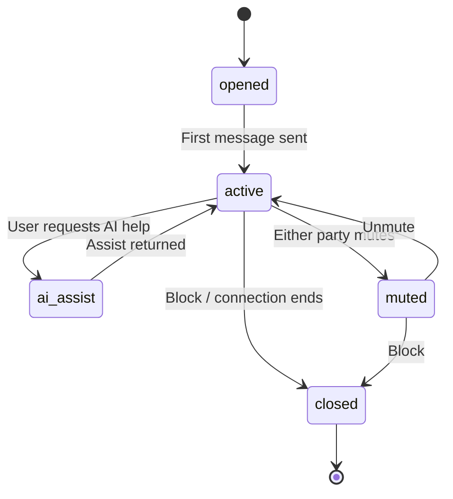

# Conversation / Messaging — State Contract

**Project:** Z-Connect  
**Domain schemas:** `conversation`, `message`  
**Flow:** [Messaging](../../interaction-contracts/flows/MESSAGING_FLOW.md)

## State diagram

## States

| State | Meaning | Actor | Terminal |
| ----- | ------- | ----- | -------- |
| opened | Thread exists (connection active) | System | No |
| active | Messages flowing | Both | No |
| ai_assist | AI drafting/help in progress | AI + User | No |
| muted | Notifications off, thread intact | Either | No |
| closed | Ended by block or connection close | Either | Yes |

## Transitions

| From | To | Trigger | Gates |
| ---- | -- | ------- | ----- |
| opened | active | First message | Connection active |
| active | ai_assist | User requests help | Shadow (on AI output) |
| ai_assist | active | Assist delivered | Shadow |
| active | muted | Mute | — |
| muted | active | Unmute | — |
| active | closed | Block / connection ends | — |

## Governance notes

- Requires an `active` [Connection](CONNECTION_REQUEST_STATE.md).
- **No auto-send** — AI drafts only; user sends (interaction contract law).
- AI assist output → **Shadow** before shown.
- No AI capture of private messages without consent.

## Out of scope

- Delivery receipts · encryption · retention windows (Phase 1.6+)
