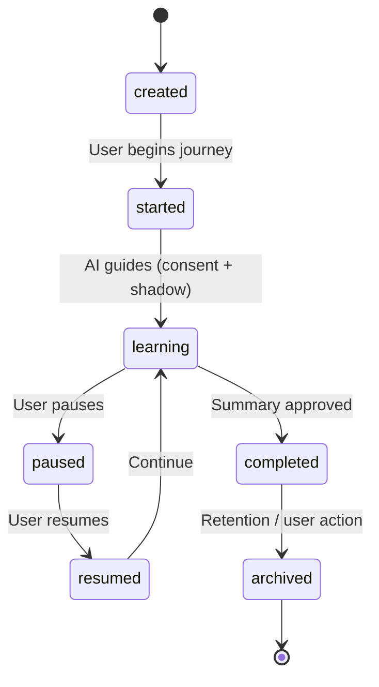

# Discovery Journey — State Contract

**Project:** Z-Connect  
**Domain schemas:** `ai-discovery-session`, `discovery-*`, `consent-record`  
**Flow:** [AI Discovery](../../interaction-contracts/flows/AI_DISCOVERY_FLOW.md)

## State diagram

## States

| State | Meaning | Actor | Terminal |
| ----- | ------- | ----- | -------- |
| created | Session record exists, not begun | System | No |
| started | User has entered the journey | User | No |
| learning | AI actively guiding, capturing preferences | AI + User | No |
| paused | User paused; no capture | User | No |
| resumed | Transitional back into learning | User | No |
| completed | User approved discovery summary | User | No |
| archived | Retained per policy; read-only | System/User | Yes |

## Transitions

| From | To | Trigger | Gates |
| ---- | -- | ------- | ----- |
| created | started | User begins | Consent |
| started | learning | AI guidance begins | Consent, Shadow |
| learning | paused | User pauses | — |
| paused | resumed | User resumes | — |
| resumed | learning | Continue | Shadow |
| learning | completed | User approves summary | Shadow, Human review (self-approve) |
| completed | archived | Retention or user | — |

## Governance notes

- `learning` captures preferences → **Consent** required before and during.
- Any AI-produced summary reaching the user → **Shadow** validation.
- No auto-complete; the user must approve the summary (human decides).

## Out of scope

- Retry logic · storage encryption · notification timing (Phase 1.6+)
