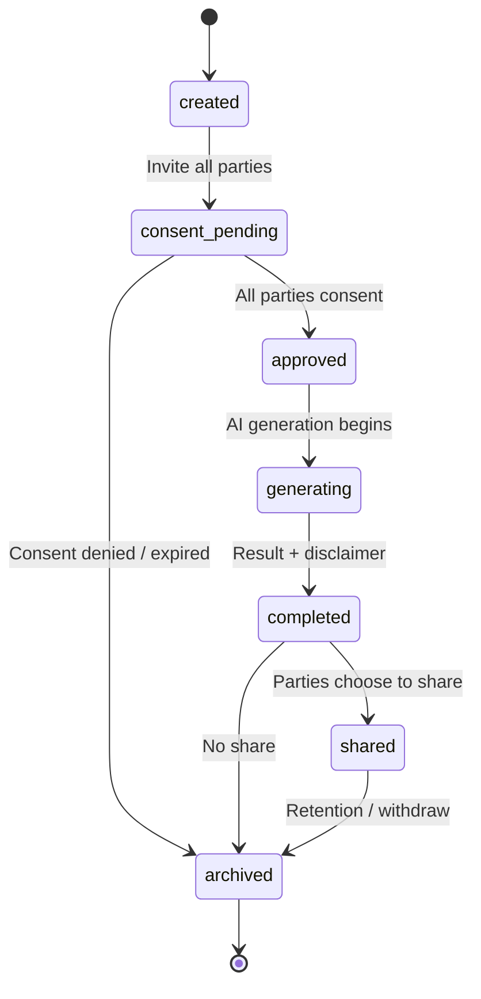

# Dream Baby Studio — State Contract

**Project:** Z-Connect  
**Domain schemas:** `dream-baby-session`, `dream-baby-consent`  
**Flow:** [Dream Baby](../../interaction-contracts/flows/DREAM_BABY_FLOW.md)  
**Posture:** Entertainment — mandatory disclaimer · all-party consent · elevated DRP

## State diagram

## States

| State | Meaning | Actor | Terminal |
| ----- | ------- | ----- | -------- |
| created | Session initialised | Initiator | No |
| consent_pending | Awaiting all-party consent | Parties | No |
| approved | All parties consented | System | No |
| generating | AI producing result | AI | No |
| completed | Result ready with disclaimer | System | No |
| shared | Parties shared result | Parties | No |
| archived | Retained / withdrawn | System/User | Yes |

## Transitions

| From | To | Trigger | Gates |
| ---- | -- | ------- | ----- |
| created | consent_pending | Invite parties | Consent |
| consent_pending | approved | All parties consent | Consent (all-party), DRP |
| consent_pending | archived | Denied / expired | — |
| approved | generating | Generation begins | DRP |
| generating | completed | Result + disclaimer | Shadow |
| completed | shared | Parties share | Consent (all-party) |
| completed | archived | No share | — |
| shared | archived | Retention / withdraw | Consent (withdraw) |

## Governance notes

- **All-party consent** is mandatory before `approved` and before `shared`.
- Elevated **DRP** — entertainment content depicting a potential child.
- AI output → **Shadow** required; mandatory **entertainment disclaimer** const from domain schema.
- Any party may withdraw → moves toward `archived`.

## Out of scope

- Image model choice · storage · watermarking implementation (Phase 1.6+)
