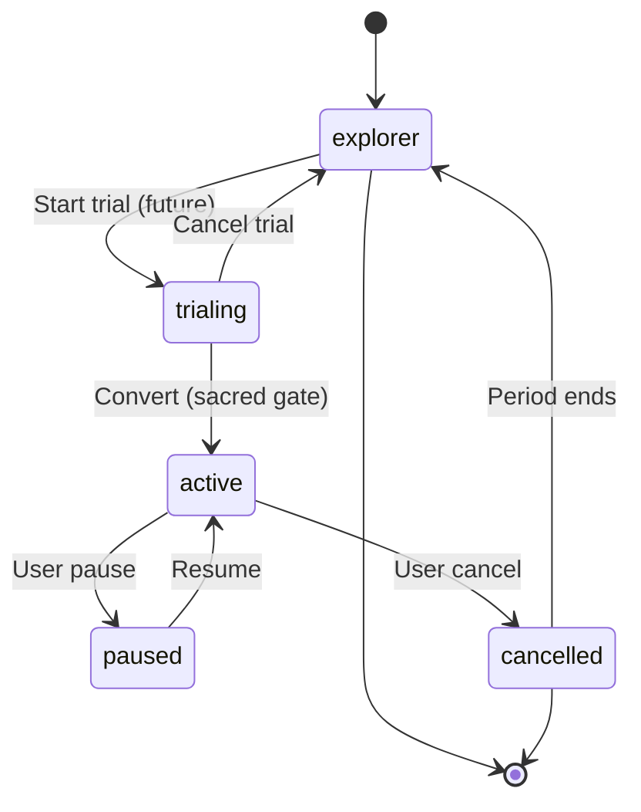

# Membership (Premium) — State Contract

**Project:** Z-Connect  
**Domain schemas:** `membership`, `plan`, `entitlement`  
**Flow:** [Premium Upgrade](../../interaction-contracts/flows/PREMIUM_UPGRADE_FLOW.md)  
**Posture:** **Sacred** — live payment HOLD until AMK + legal gate

## State diagram

## States

| State | Meaning | Actor | Terminal |
| ----- | ------- | ----- | -------- |
| explorer | Free tier (default) | User | No |
| trialing | Trial period (future) | User | No |
| active | Paid membership live | User | No |
| paused | Temporarily paused | User | No |
| cancelled | Ended, running out period | User | Yes |

## Transitions

| From | To | Trigger | Gates |
| ---- | -- | ------- | ----- |
| explorer | trialing | Start trial | DRP |
| trialing | active | Convert to paid | **DRP + Human (sacred)** |
| trialing | explorer | Cancel trial | — |
| active | paused | User pause | — |
| paused | active | Resume | DRP |
| active | cancelled | User cancel | — |
| cancelled | explorer | Period ends | — |

## Governance notes

- **`trialing → active` is a sacred move** — no live charge in B1.6 / pre-charter; requires **DRP + Human** gate.
- No AI pressure to upgrade; no "match expires" tied to payment.
- Clear cancel path documented before any pay (interaction contract).

## Out of scope

- Payment provider · billing cycles · tax/VAT · refunds (separate sacred charter)
