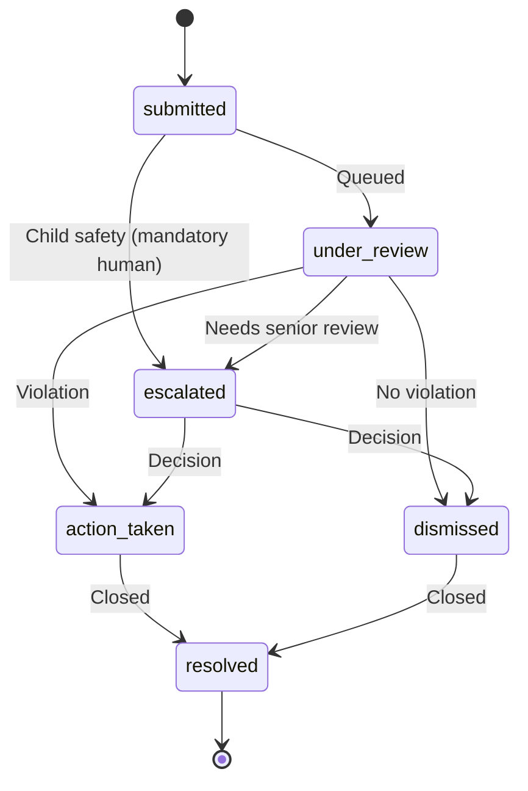
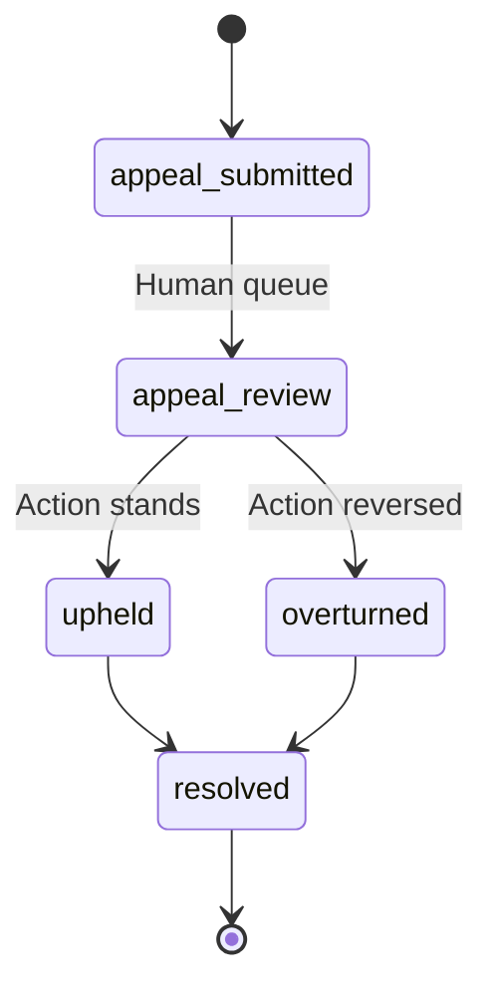

# Moderation & Appeal — State Contract

**Project:** Z-Connect  
**Domain schemas:** `report`, `review`, `safety-action`, `appeal`  
**Flows:** [Moderation](../../interaction-contracts/flows/MODERATION_FLOW.md), [Appeal](../../interaction-contracts/flows/APPEAL_FLOW.md)

## Report / review state diagram

## Appeal state diagram

## States

| State | Meaning | Actor | Terminal |
| ----- | ------- | ----- | -------- |
| submitted | Report filed | Reporter | No |
| under_review | Being reviewed | Reviewer | No |
| escalated | Senior / mandatory human | Reviewer | No |
| action_taken | Safety action applied | Reviewer | No |
| dismissed | No violation found | Reviewer | No |
| appeal_submitted | Subject appeals | Appellant | No |
| appeal_review | Human reviewing appeal | Reviewer | No |
| upheld / overturned | Appeal outcome | Reviewer | No |
| resolved | Case closed | System | Yes |

## Transitions (gated)

| From | To | Trigger | Gates |
| ---- | -- | ------- | ----- |
| submitted | escalated | Child safety category | **DRP + Human (mandatory)** |
| under_review | action_taken | Violation confirmed | DRP, Human |
| appeal_review | overturned | Appeal succeeds | Human |
| appeal_review | upheld | Appeal fails | Human |

## Governance notes

- **Child safety → mandatory human**; no AI-only ban.
- Ban/suspend must have an **appeal path** before becoming terminal.
- Reporter identity protected; no public moderation leaderboard.

## Out of scope

- SLA timers · reviewer routing · evidence storage (Phase 1.6+)
