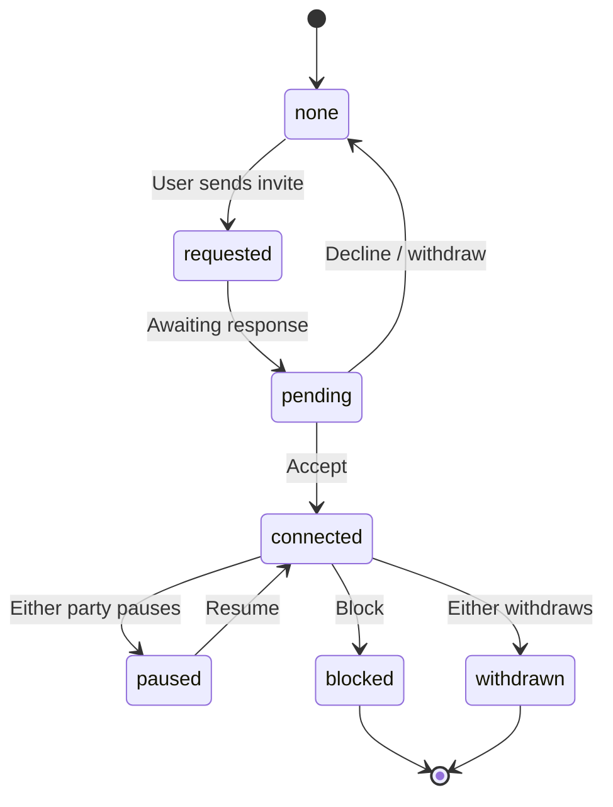
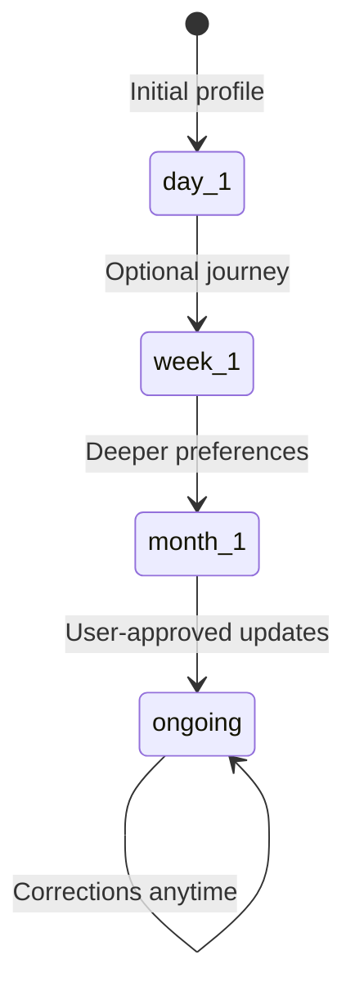

# Flow Index — Interaction Contracts v1

| Flow | Primary actors | Consent | Shadow | DRP | Domain schemas |
| ---- | -------------- | ------- | ------ | --- | -------------- |
| [AI Discovery](flows/AI_DISCOVERY_FLOW.md) | User, AI guide | Required | Required | Standard | `ai-discovery-session`, `discovery-*`, `consent-record` |
| [Compatibility Insight](flows/COMPATIBILITY_INSIGHT_FLOW.md) | User, AI guide | Required | Required | Standard | `compatibility-insight`, `connection-confidence` |
| [Connection Request](flows/CONNECTION_REQUEST_FLOW.md) | User A, User B | Implicit invite | N/A | Standard | `connection-request`, `connection-state` |
| [Messaging](flows/MESSAGING_FLOW.md) | Users | Connection required | On AI assist only | Standard | `conversation`, `message` |
| [Dream Baby](flows/DREAM_BABY_FLOW.md) | Users (2+) | All-party | Required | Elevated | `dream-baby-consent`, `dream-baby-session` |
| [Consent](flows/CONSENT_FLOW.md) | User | Self | N/A | Standard | `consent-record`, `consent-withdrawal` |
| [Premium Upgrade](flows/PREMIUM_UPGRADE_FLOW.md) | User | Payment terms | N/A | **Sacred** | `membership`, `plan` |
| [Account Deletion](flows/ACCOUNT_DELETION_FLOW.md) | User | Confirm | N/A | Elevated | profile cascade |
| [Privacy Export](flows/PRIVACY_EXPORT_FLOW.md) | User | Confirm | N/A | Elevated | all user-owned |
| [Moderation](flows/MODERATION_FLOW.md) | User, reviewer | N/A | N/A | Elevated | `report`, `review`, `safety-action` |
| [Appeal](flows/APPEAL_FLOW.md) | User, reviewer | N/A | N/A | Elevated | `appeal` |

## State diagram — connection lifecycle

## Progressive Discovery phases

