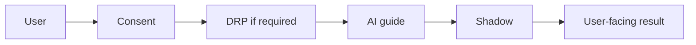

# Interaction Contract Law

**Applies to:** All flows in `interaction-contracts/flows/`  
**Version:** 1.0 · Locked with B1.5

## Principles

1. **Human decides** — AI suggests; users approve, decline, or ignore.  
2. **Consent before capture** — No silent profiling from private messages.  
3. **Explain before show** — Connection Confidence includes why, confidence level, limitations.  
4. **No objective truth claims** — Insights are exploratory, not verdicts.  
5. **Stop on block** — Shadow reject or DRP `blocked` halts the flow; no partial unsafe output.  
6. **Escalate sacred moves** — DRP `pending_human` pauses until AMK/operator gate (when runtime exists).  

## Standard sequence pattern (AI paths)

```text
User intent
  → Consent verified (if required)
  → Security classify (future: zuno-security)
  → DRP evaluate (if category requires)
  → AI generate (guide only)
  → Shadow validate
  → User review / approve (if persisting)
  → Domain contract persist
  → Observability audit (correlationId)
```

## Standard sequence pattern (human-human paths)

```text
User intent
  → Consent / connection state check
  → DRP (if payment, export, deletion)
  → Action
  → Audit event
```

## Forbidden in every flow

- Auto-accept connection requests  
- Auto-send messages on user's behalf  
- Compatibility percentages or destiny language  
- Skipping consent for shared experiences  
- Bypassing Shadow for AI output  
- Live payment without sacred gate  

## Diagram legend



Solid gates are **mandatory** when the flow doc marks them required.
