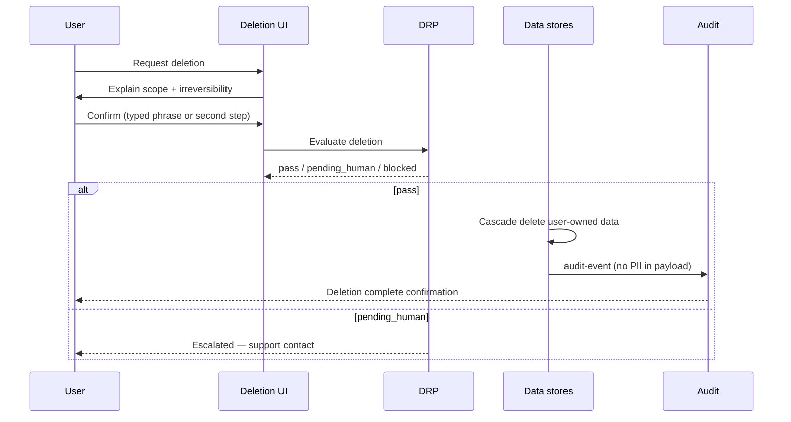

# Account Deletion Flow

**Version:** 1.0 · Interaction contract  
**Domain schemas:** user profile cascade, `consent-withdrawal`, governance `audit-event`

## Purpose

User-initiated **right to erasure** — delete account and associated data with confirmation and audit trail.

## Actors

- **User**  
- **DRP** — elevated (irreversible action)  
- **Platform** — executes cascade per retention policy  

## Preconditions

- User authenticated  
- No pending sacred disputes (optional hold — implementation)  

## Sequence

## Data scope (design intent)

| Category | Action |
| -------- | ------ |
| Profile, preferences | Delete |
| Messages | Delete or anonymize per policy |
| Consent logs | Retain minimal legal record if required — document in privacy policy |
| Billing records | Retain per law — separate charter |
| Shared experiences | Notify other party; remove user contribution |

## Consent checkpoints

- Double confirmation for deletion  
- Export offered before delete (link to Privacy Export flow)  

## Forbidden

- Hidden retention without disclosure  
- Deletion that leaves AI training ghosts without charter  

## Out of scope

- Legal retention schedule authoring  
