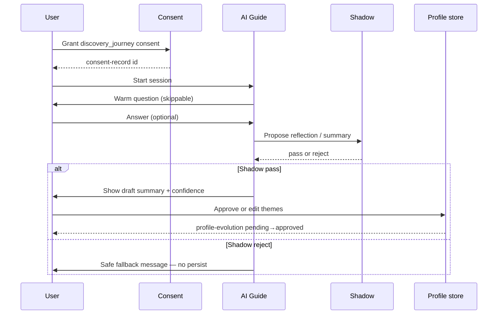

# AI Discovery Flow

**Version:** 1.0 · Interaction contract  
**Domain schemas:** `ai-discovery-session`, `discovery-journey`, `discovery-question`, `discovery-answer`, `discovery-reflection`, `discovery-summary`, `profile-evolution`, `consent-record`

## Purpose

Guide new users through **Progressive Discovery** via conversational onboarding — building profile themes the user **approves**, not silent inference.

## Actors

- **User** — provides answers, approves summaries  
- **AI guide** — asks questions, proposes themes (never decides)  
- **Shadow validator** — blocks unsafe generative output  
- **DRP** — standard posture unless sacred category triggered  

## Preconditions

- User authenticated (future)  
- `privacy-settings.allowDiscoveryJourney` = true  
- Valid `consent-record` for scope `discovery_journey`  

## Sequence

## Consent checkpoints

| Step | Consent |
| ---- | ------- |
| Start journey | `discovery_journey` scope granted |
| Persist themes | User explicit approve on `discovery-summary` |
| Pause / delete | User may withdraw consent — cascade delete |

## AI Constitution rules

- No dependency creation (“I’m always here for you”)  
- No pressure to continue  
- Explain uncertainty on every reflection  
- Encourage human connection off-platform when appropriate  

## Governance

| Gate | Required |
| ---- | -------- |
| Shadow | Yes — every AI utterance before display |
| DRP | Standard; escalate child-safety keywords |
| Observability | `correlationId` on session |

## Forbidden

- Silent save of journey transcript without consent scope  
- Astrology prompts presented as matching science  
- Clinical diagnosis language  

## Out of scope (B1.5)

- LLM provider selection · voice input · push notifications  
