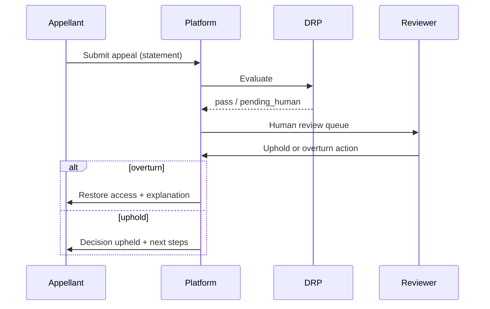
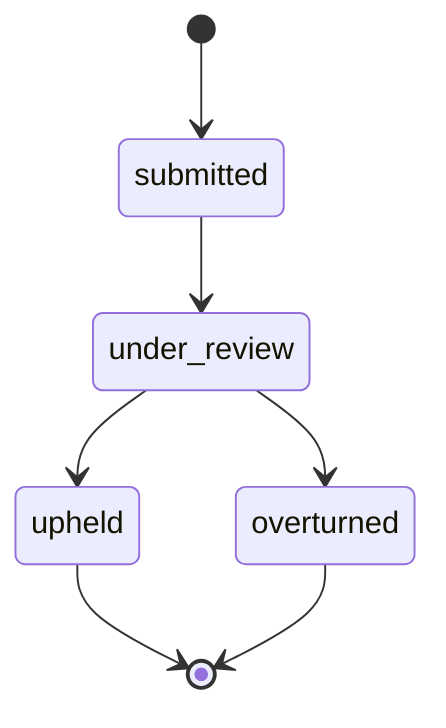

# Appeal Flow

**Version:** 1.0 · Interaction contract  
**Domain schemas:** `appeal`, `review`, `safety-action`

## Purpose

Allow users to **appeal** moderation decisions with human review — proportional, transparent process.

## Actors

- **Appellant** — subject of moderation action  
- **Reviewer** — human (required for ban/suspend)  
- **DRP** — elevated  

## Preconditions

- Valid `review` exists with `action_taken`  
- Appeal window open (policy TBD in legal draft)  

## Sequence

## Consent / fairness

- Appellant sees their statement and outcome summary  
- No AI-generated legal advice  

## State

## Forbidden

- Infinite appeal loops without policy  
- AI-only appeal decisions for permanent bans  

## Out of scope

- Court/law enforcement process  
