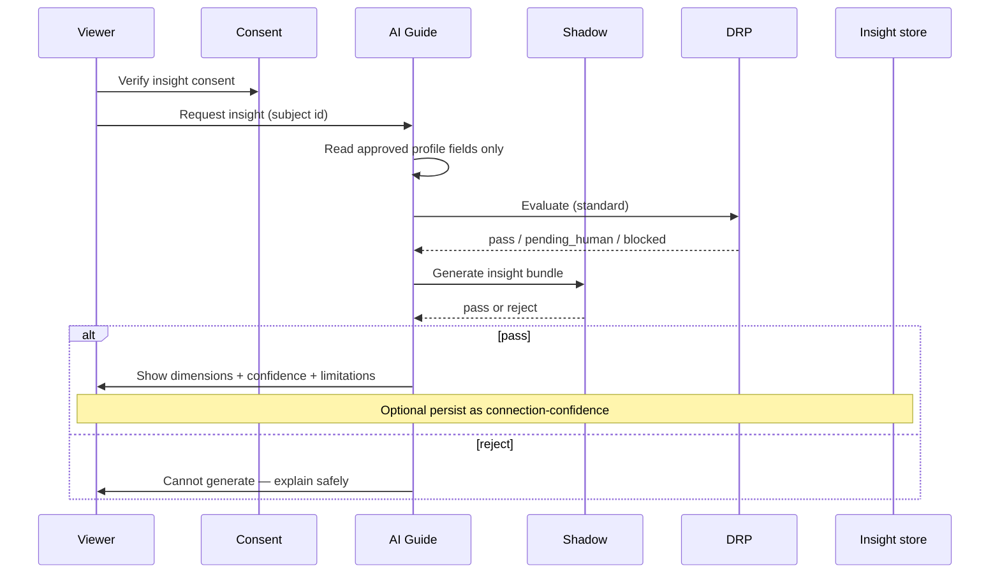
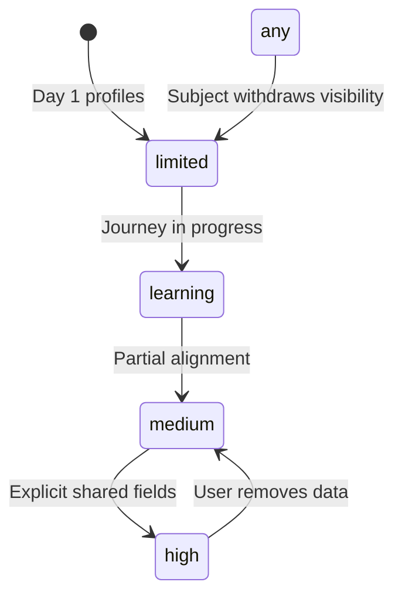

# Compatibility Insight Flow

**Version:** 1.0 · Interaction contract  
**Domain schemas:** `compatibility-insight`, `connection-confidence`, `connection-confidence-evolution`

## Purpose

When a user **requests** insight about another user, surface **Connection Confidence** observations — never percentages or destiny verdicts.

## Actors

- **Viewer** — requests insight  
- **Subject** — must have shareable approved profile per privacy settings  
- **AI guide** — composes dimension narratives  
- **Shadow** · **DRP** — gates  

## Preconditions

- Viewer consent: `allowInsightGeneration`  
- Subject profile visibility permits viewer  
- No block between users  

## Sequence

## Required presentation (UI contract)

Each dimension shows:

1. Narrative (plain language)  
2. Confidence: high | medium | limited | learning  
3. Source field refs (user-approved only)  
4. Disclaimer (immutable template)  
5. Conversation starter (optional)  

## Forbidden

- `percentCompatible` or rank ordering of people  
- “Soulmate” / “destined” language  
- Hidden sort score derived from confidence  

## State — confidence evolution

## Out of scope

- Auto-surfacing insights without request  
- Batch compatibility for lists  
