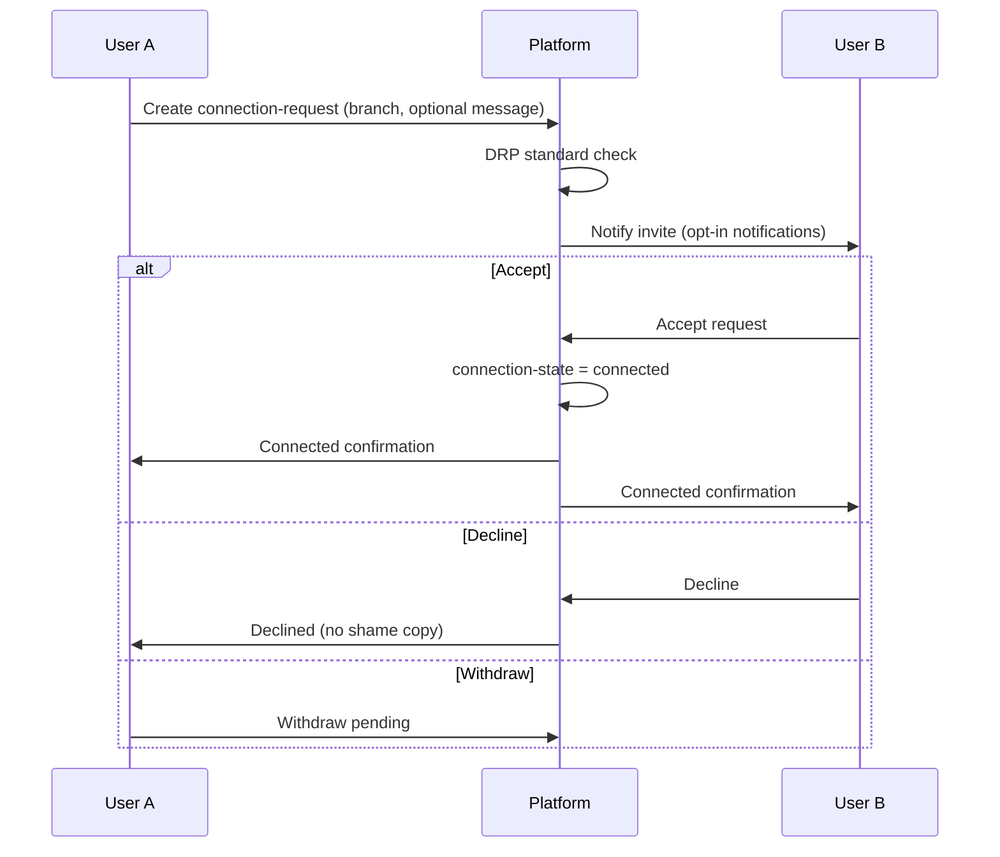

# Connection Request Flow

**Version:** 1.0 · Interaction contract  
**Domain schemas:** `connection-request`, `connection-state`, `relationship-goal`, `user-block`

## Purpose

Enable **consent-based** connection invitations between users on a chosen relationship branch (friendship, soulmate path, couples, etc.).

## Actors

- **Inviter (User A)**  
- **Invitee (User B)**  
- **Platform** — delivers invite; never auto-accepts  

## Preconditions

- Neither user blocked the other  
- Inviter profile meets minimum visibility for branch  
- Rate limits (future) — anti-spam  

## Sequence

## Consent checkpoints

- Inviter message must not coerce  
- Invitee **must explicitly accept** — no default accept  
- Either party may block at any time  

## AI Constitution

- No “you might miss your match” urgency on pending invites  
- No leaderboard of pending requests  

## Forbidden

- Auto-accept · auto-connect from AI recommendation  
- Referral pressure or gamified invite counts  

## State diagram

See [FLOW_INDEX.md](../FLOW_INDEX.md) — connection lifecycle.

## Out of scope

- Group connections · event RSVP (separate events flow future)  
