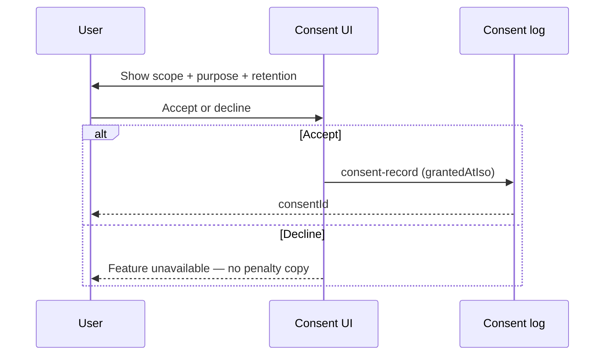
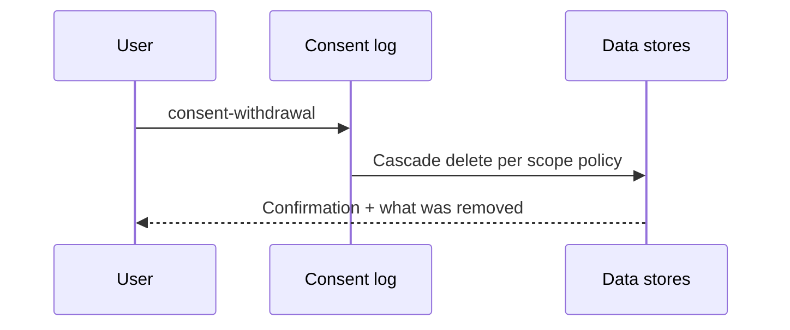

# Consent Flow

**Version:** 1.0 · Interaction contract  
**Domain schemas:** `consent-record`, `consent-scope`, `consent-version`, `consent-withdrawal`

## Purpose

Central **consent-first** pattern for every data use — grant, version, withdraw, audit.

## Actors

- **User**  
- **Platform** — stores append-only consent log  

## Sequence — grant

## Sequence — withdraw

## Scope examples

| scopeId | Purpose |
| ------- | ------- |
| `discovery_journey` | AI Discovery sessions |
| `insight_generation` | Compatibility insights |
| `marketing_email` | Opt-in marketing only |
| `dream_baby_studio` | Shared creative session |

## Governance

- Consent text version tracked via `consent-version`  
- Withdrawal must complete within documented SLA (implementation)  
- DRP audit on bulk consent changes  

## Forbidden

- Pre-checked boxes for sensitive scopes  
- Bundled consent hiding optional features  
- Continued processing after withdrawal  

## Out of scope

- Legal text authoring (Stream B legal drafts)  
