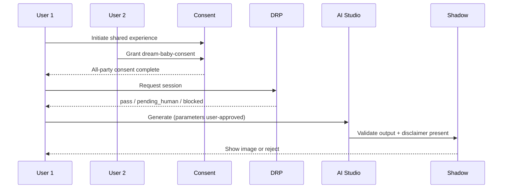

# Dream Baby Studio Flow

**Version:** 1.0 · Interaction contract  
**Domain schemas:** `dream-baby-consent`, `shared-experience-consent`, `dream-baby-session`

## Purpose

**Creative AI entertainment** — artistic family visualization. **Not** genetic prediction or medical claim.

## Actors

- **All participants** (minimum 2) — must consent  
- **AI generator** — creative output only  
- **Shadow** — mandatory  
- **DRP** — elevated posture  

## Preconditions

- Every participant granted `dream-baby-consent`  
- `shared-experience-consent` record complete  
- Entertainment disclaimer shown and acknowledged  

## Mandatory disclaimer

> This is an imaginative AI-generated creation for entertainment and inspiration. It is not a prediction of a real child's appearance.

## Sequence

## Consent checkpoints

| Step | Requirement |
| ---- | ----------- |
| Initiate | Both users see disclaimer |
| Generate | `shared-experience-consent` ids attached |
| Share externally | **Forbidden** without separate consent charter |
| Delete | Any participant may request session delete |

## Forbidden

- “Predict your future child” marketing  
- Medical / genetic accuracy claims  
- Minors without guardian sacred gate  

## Out of scope

- 3D genetics · DNA input · public gallery without charter  
