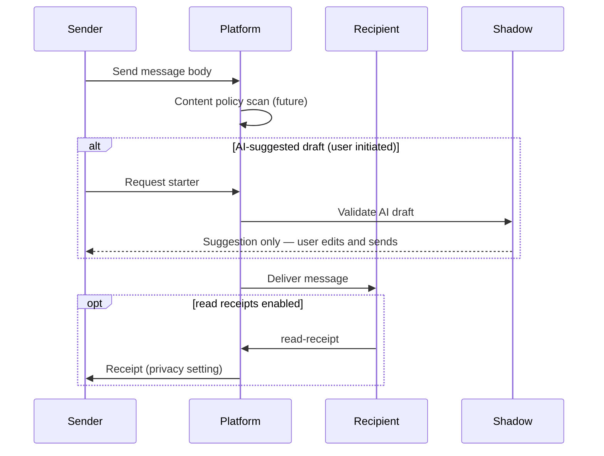

# Messaging Flow

**Version:** 1.0 · Interaction contract  
**Domain schemas:** `conversation`, `message`, `attachment`, `reaction`, `read-receipt`, `moderation-event`

## Purpose

Human-to-human messaging between **connected** users — AI assists only when explicitly invoked; never sends on user's behalf.

## Actors

- **Participants** — connected users  
- **AI guide** (optional) — conversation starters only when user asks  
- **Moderation** — report pipeline  

## Preconditions

- `connection-state` = connected (or branch-specific rules)  
- Neither party blocked  
- Messaging entitlement (future subscription) if gated  

## Sequence — send message

## Consent checkpoints

- Read receipts off by default unless user opts in  
- Attachments require explicit user upload action  
- AI never auto-sends  

## Moderation pathway

User may report → see [MODERATION_FLOW.md](MODERATION_FLOW.md)

## Forbidden

- AI impersonating user in thread  
- Scraping messages for matching without explicit charter  
- Harassment-enabling bulk messaging  

## Out of scope (B1.5)

- E2E encryption spec (Phase 1.6+ security charter)  
- Voice/video calls  
