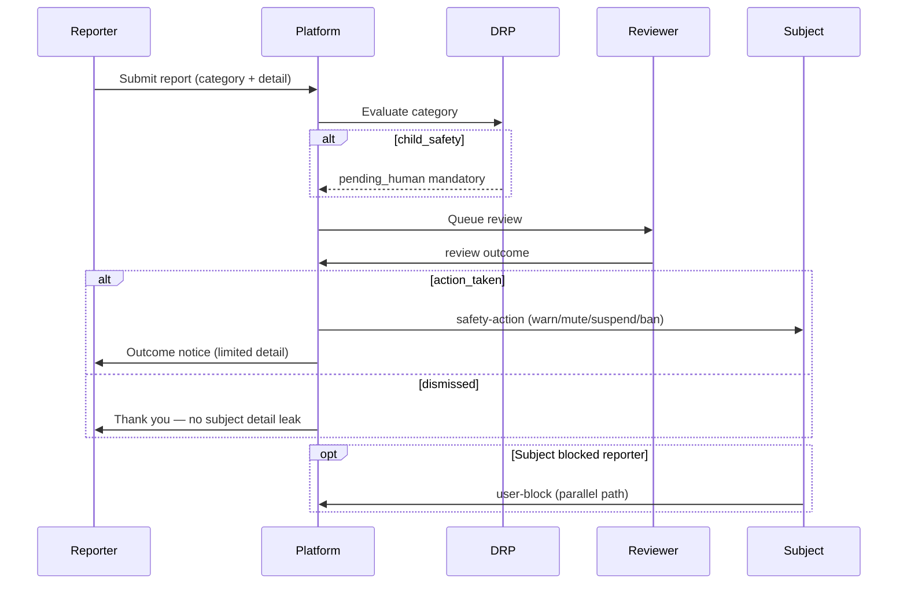
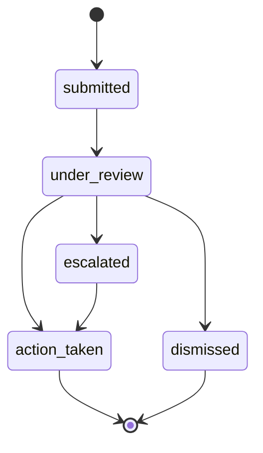

# Moderation Flow

**Version:** 1.0 · Interaction contract  
**Domain schemas:** `report`, `review`, `safety-action`, `user-block`, `moderation-event`

## Purpose

Safety reporting and review — protect users without surveillance culture or public shaming.

## Actors

- **Reporter** — any user  
- **Subject** — reported user or content  
- **Reviewer** — human or policy workflow (future)  
- **DRP** — elevated; child safety → mandatory human  

## Sequence

## Consent / privacy

- Reporter identity protected from subject by default  
- No public moderation leaderboard  

## AI Constitution

- No AI auto-ban without human review path for edge cases  
- Compassionate copy to reporter and subject  

## State — report

## Forbidden

- Retaliatory exposure of reporter  
- Automated permanent ban without appeal path  

## Related

- [APPEAL_FLOW.md](APPEAL_FLOW.md)  
