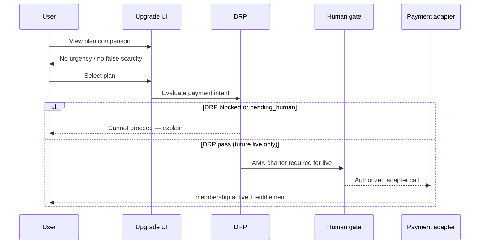
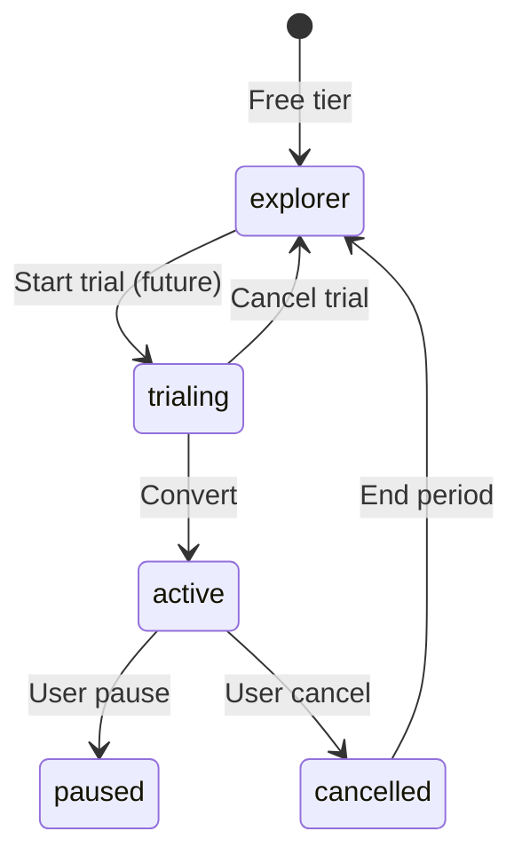

# Premium Upgrade Flow

**Version:** 1.0 · Interaction contract  
**Domain schemas:** `plan`, `membership`, `entitlement`, `invoice-reference`, `premium-feature`  
**Posture:** **Sacred move** — live payment HOLD until AMK + legal gate

## Purpose

Describe how a user **chooses** to upgrade — transparent pricing, no dark patterns, human gate before live charges.

## Actors

- **User**  
- **DRP** — sacred posture for payment intents  
- **Payment adapter** (future) — external; not in B1.5  

## Preconditions

- User authenticated  
- Plans published with clear tier labels (explorer / member / supporter)  
- Terms + privacy acknowledged for payment scope  

## Sequence (design — not live)

## Consent checkpoints

- Explicit opt-in to recurring billing terms  
- Clear cancel path described before pay  
- Marketing ≠ checkout consent  

## AI Constitution

- No AI pressuring upgrade  
- No “your match expires” tied to payment  

## Forbidden (always)

- Live charge in B1.5 / pre-charter  
- Hidden fees · bait-and-switch tiers  
- Auto-upgrade without confirmation  

## State — membership

## Out of scope

- Payment provider integration · tax/VAT engine  
