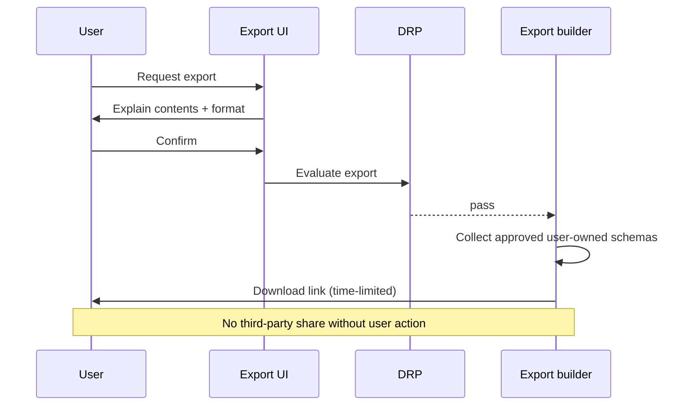

# Privacy Export Flow

**Version:** 1.0 · Interaction contract  
**Domain schemas:** user domain bundle, `consent-record`, governance `audit-event`

## Purpose

User-initiated **data portability** — export machine-readable bundle of user-owned data.

## Actors

- **User**  
- **DRP** — elevated for bulk export  
- **Platform** — assembles export  

## Preconditions

- User authenticated  
- Rate limit (future) — anti-abuse  

## Sequence

## Export contents (v1 intent)

- Profile, preferences, interests, values, lifestyle  
- Consent records  
- Discovery summaries user approved  
- Connection list metadata (not other users' PII)  
- Messages sent by user  

## Excluded

- Other users' private data  
- Internal moderation notes about others  
- Raw AI prompts with other users' identifiers  

## Governance

- Audit event with `correlationId`  
- Export link expires  
- DRP `pending_human` for anomalous bulk patterns  

## Forbidden

- Selling export data · emailing export without user download action  

## Out of scope

- Real-time sync to third parties  
