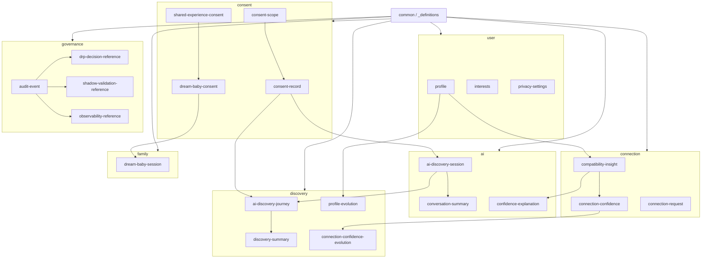

# Z-Connect Contract Dependency Map

**Version:** 1.0 · Phase 1.5 B1

## Master diagram

## Dependency rules

| Rule | Detail |
| ---- | ------ |
| **Acyclic** | No schema `$ref` cycles detected in v1 |
| **Root** | All domain schemas `$ref` common `_definitions` only |
| **Cross-domain** | `connection-confidence` embeds `compatibility-insight` by `$id` URL |
| **Consent first** | AI sessions and shared family features reference consent records |
| **Governance refs** | Audit events link to hub DRP/Shadow/Observability — not embedded runtime |

## Hub package alignment (future)

| Z-Connect contract | Hub package |
| ------------------ | ----------- |
| `shadow-validation-reference` | `@z-sanctuary/zuno-shadow` |
| `drp-decision-reference` | `@z-sanctuary/zuno-drp` |
| `observability-reference` | `@z-sanctuary/zuno-observability` |
| `ZDRPDecision` shape | `zuno-orchestrator-contracts` |

## Verification

- No duplicate model IDs across domains  
- No circular `$ref` chains in v1 catalog  
- Forbidden keys absent from schemas and examples (validate script)
